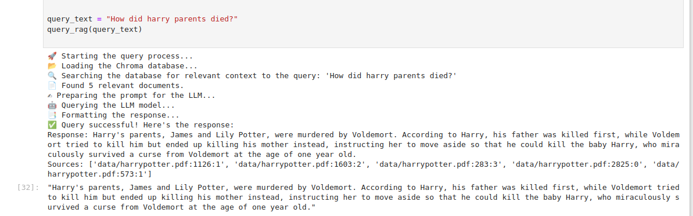

# LLM_RAG
Adding an Retrieval augmented generation(RAG) over llama3.2 3B

This project implements a Retrieval-Augmented Generation (RAG) system that queries a Large Language Model (LLM) using a context-based search mechanism. The system retrieves relevant documents from a vector database (Chroma) and passes them as context to the LLM, which generates a response. The system can be used to answer questions based on external documents stored in the Chroma database, combining retrieval and generative capabilities for enhanced response accuracy.

# Features
* RAG System: Combines retrieval of relevant documents from Chroma with LLM-based question answering.
* LLM Integration: Uses the Ollama LLM for answering queries.
* Vector Search: Utilizes vector embeddings to retrieve relevant chunks of text.
* Chroma Database: Persistent document store with document similarity search.

# Requirements
- Python 3.8 or higher
- langchain
- langchain_community
- chroma
- ollama

# Query results
RAG based system results are far better than any fine-tuning the model from scratch.

